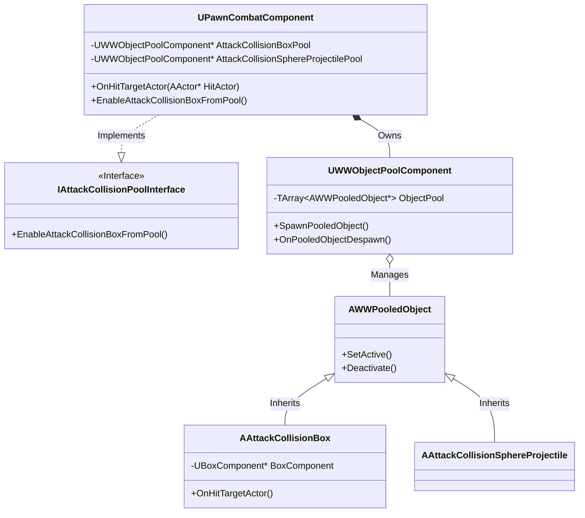
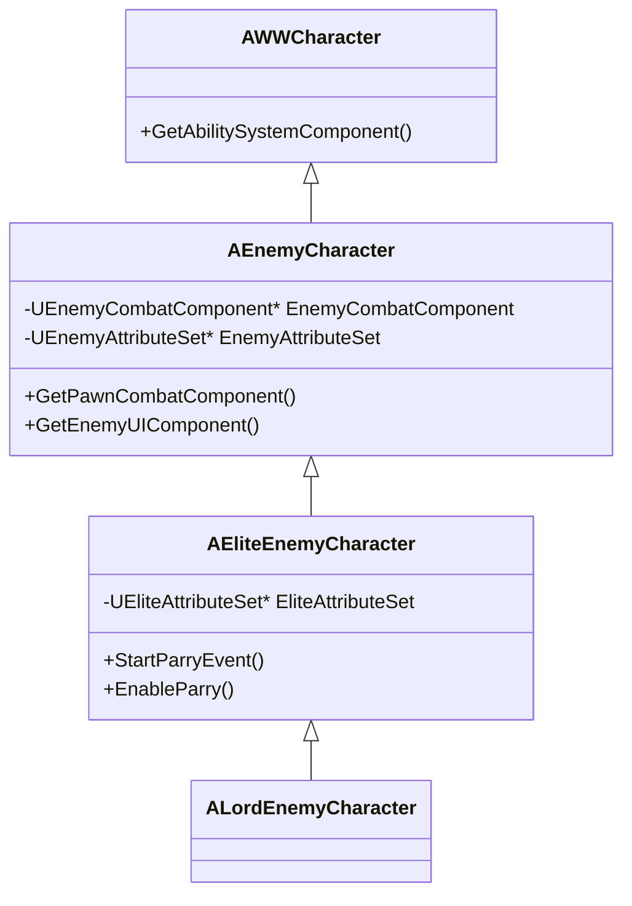
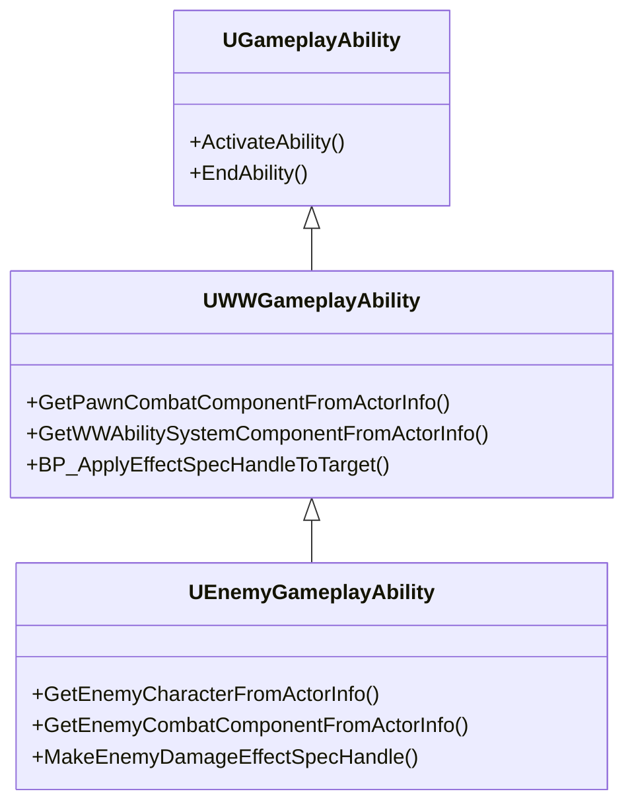

# Wuthering Waves (Portfolio Project)

## 팀원
+ 정민수(팀장): 몬스터 / 전투
+ 유호근: 캐릭터
+ 김미진: 인벤토리 / UI

## 📖 프로젝트 소개
이 프로젝트는 언리얼 엔진 5를 활용하여 오픈월드 액션 RPG '명조: 워더링 웨이브'의 전투 및 게임플레이 메커니즘을 모작한 포트폴리오 프로젝트입니다.  
팀 프로젝트로 진행되었으며, 저는 **전투 시스템의 핵심 구조 설계 및 구현**과 **적(Enemy) 캐릭터 및 AI 시스템** 전반을 담당했습니다.

## 🛠️ 기술 스택 (Tech Stack)
- **Engine**: Unreal Engine 5
- **Language**: C++
- **Framework**: Gameplay Ability System (GAS)
- **Tools**: Rider, Git

## 👨‍💻 담당 구현 파트 (My Contributions)

### 1. 범용 전투 시스템 (Generic Combat System)
플레이어와 몬스터가 모두 사용할 수 있는 유연하고 확장 가능한 전투 시스템을 설계했습니다.

#### ⚔️ PawnCombatComponent
- 전투 로직을 담당하는 컴포넌트로, 공격 실행 및 충돌 처리를 중앙에서 관리합니다.
- `IAttackCollisionPoolInterface`를 통해 다양한 형태의 공격 콜리전을 오브젝트 풀에서 가져와 사용하도록 설계하여 성능을 최적화했습니다.

#### 📦 AttackCollision System
- **다형성 기반 콜리전**: `AttackCollisionBox`, `Sphere`, `Capsule` 등 다양한 형태의 공격 범위를 지원하며, 모두 `AWWPooledObject`를 상속받아 풀링이 가능합니다.
- **GAS 연동**: 공격 적중 시 `GameplayEffect`를 적용하여 데미지 및 상태 이상 처리를 데이터 기반으로 수행합니다.
- **유연한 부착 시스템**: 소켓 이름을 통해 캐릭터의 특정 부위에 부착하거나, 월드 공간에 독립적으로 스폰(투사체 등)할 수 있습니다.

#### 📊 Combat System Class Diagram

### 2. 오브젝트 풀링 시스템 (Object Pooling)
- **WWObjectPool & WWObjectPoolComponent**: 빈번하게 생성/파괴되는 투사체 및 공격 콜리전의 성능 부하를 줄이기 위해 오브젝트 풀을 구현했습니다.
- 동적 할당 및 재사용 로직을 통해 가비지 컬렉션(GC) 오버헤드를 최소화하고 프레임 드랍을 방지했습니다.

### 3. 적(Enemy) 캐릭터 및 AI (JMS Module)
- **EnemyCharacter 계층 구조**: `EnemyCharacter`를 베이스로 `Elite`, `Lord` 등 등급별 적 캐릭터 클래스를 설계하여 확장성을 확보했습니다.
- **GAS 기반 AI**: `EnemyGameplayAbility` 및 `EnemyAttributeSet`을 구현하여 적의 스킬과 스탯을 체계적으로 관리했습니다.
- **Motion Warping**: 공격 시 타겟을 향해 자연스럽게 회전하거나 이동하도록 모션 워핑을 적용하여 전투의 타격감을 높였습니다.

#### 👾 Monster Class Diagram

#### ⚡ Gameplay Ability Class Diagram

## 📂 프로젝트 구조 (JMS Folder)
제가 담당한 `JMS` 폴더의 주요 구조는 다음과 같습니다.
- **AbilitySystem**: 적 전용 어빌리티 및 어트리뷰트 셋 (`EnemyGameplayAbility`, `EnemyAttributeSet`)
- **Character**: 적 캐릭터 클래스 계층 (`EnemyCharacter`, `EliteEnemyCharacter` 등)
- **Combat**: 전투 컴포넌트 및 관련 로직

---
